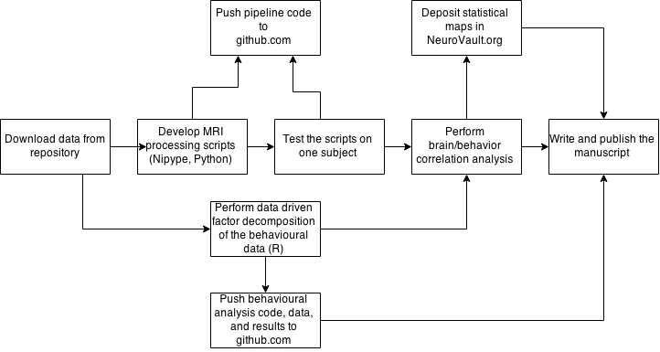

##### Introduction
*Please answer these introductory questions for your case study in a few sentences.*

1) Who are you and what is your research field? Include your name, affiliation, discipline, and the background or context of your overall research that is necessary specifically to introduce your specific case study.

My name is Chris Gorgolewski and I work at Stanford University in the department of Psychology. My field of research can be broadly characterized as Human Cognitive Neuroimaging. In layman words we are trying to related observed human behavior to neuronal processes in the brain. 

2) Define what the term "reproducibility" means to you generally and/or in the particular context of your case study.

Reproducibility means an accurate description of experimental methodology and accessibility of tools used during the course of the study. Reproducibility is important when looking for mistakes and when attempting replications.

##### Workflow diagram

##### Workflow narrative

The goal of this study was to relate the content and the form of self generated thought (mind wandering) to the dynamics of brain activity at rest. It was based on a publicly available data collected at the Nathan Kline Institute in collaboration with Child Mind Institute (data is available [here](http://fcon_1000.projects.nitrc.org/indi/enhanced/)). Three major aspects of this study makes it reproducible

* Data is publicly available.
* Scripts to run the analysis depend on freely available software and are also publicly available.
* Results has not only been described in a [paper](http://journals.plos.org/plosone/article?id=10.1371/journal.pone.0097176), but are also available in a machine readable way.

Feature extraction (data preprocessing - everything done before fitting a model) in neuroimaging can be a complicated process involving many different components. We have written our pipelines using the [Nipype](http://nipy.org/nipype) framework that allows researchers to combine many different well tested neuroimaging tools into one pipeline. The pipeline was tested and developed on a single subjects and then run on all subjects using a local supercomputer. Neuroimaging pipelines have been deposited at [github.com](https://github.com/NeuroanatomyAndConnectivity/pipelines/tree/master/src/mindwandering).

Behavioral data have been analyzed using R and knitr package providing reproducible reports that include narrative, code and figures. The R code, input behavioral data, outputs of the analysis (factors extracted from the questionnaire) as well as the questionnaire used for the study have been deposited on [github.com](https://github.com/NeuroanatomyAndConnectivity/NYC-Q).

Results of the brain/behavior analysis were [deposited in the NeuroVault.org](http://neurovault.org/collections/16/) repository in the form of statistical maps.

Final version of all the analyses were fully automated, but the data required semiautomated quality control. Analysis has been done by one person within 3 months. Three other researchers consulted on the project.

Unfortunately no tests have been written for the data analysis software. The documentation also did not extend beyond comments and knitr reports.

##### Pain points
Documentation and tests are the major components that this project is lacking. Unfortunately writing good description of the code and valuable tests is difficult and time consuming. Test driven development could potentially help with delivering more tests, but in principle it is hard to see how this can be improved without a substantially higher work effort.

##### Key benefits
Using a workflow system such as Nipype makes work not only easier but also allows researchers to share such workflow as a form of provenance description. R and knitr provides similar advantages for simpler analysis. Knitr reports are not only a great way to share results with colleagues you collaborate with, but also makes it easy to share reproducible analysis workflows. Last, but not least [NeuroVault.org](http://neurovault.org) allows researchers not only to visualize and interpret their results but also share them with other researchers.

The main take home message I would like to convey with this example is that researchers should look for tools that help them do their work efficiently and at the same time make it easier to do reproducible science. Reproducibility is not a goal in itself, but there are plenty of tools that help achieving it while helping you doing science more efficiently. 

##### Key tools
* [Nipype](http://nipy.org/nipype) - workflow system for neuroimaging
* [knitr](http://yihui.name/knitr/) - code + narrative in R ("literate programming")
* [NeuroVault.org](http://neurovault.org) - repository for storing results of neuroimaging analyses (statistical maps)

##### General questions about reproducibility

*Please provide short answers (a few sentences each) to these general questions about reproducibility and scientific research. Rough ideas are appropriate here, as these will not be published with the case study. Please feel free to answer all or only some of these questions.*

1) Why do you think that reproducibility in your domain is important?
It crucial for maintaining trust in the results we present and discuss.

2) How or where did you learn the reproducible practices described in your case study? Mentors, classes, workshops, etc.
Mostly other people, but not necessary in person (i.e. reading stuff on the Internet).

3) What do you see as the major pitfalls to doing reproducible research in your domain, and do you have any suggestions for working around these? Examples could include legal, logistical, human, or technical challenges.
Chasing the perfection. Sharing code that is not perfect (no comments, documentation, tests) is better than not sharing code at all.

4) What do you view as the major incentives for doing reproducible research?
Engagement with broader community. I met many researchers because they wanted to discuss the code I shared.
