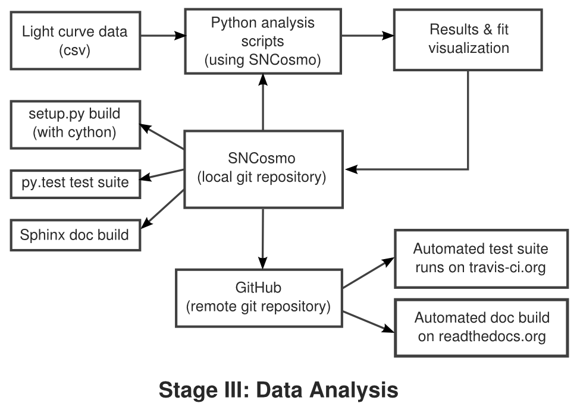

##### Title

Software for analyzing supernova light curve data for cosmology

##### Introduction

My name is Kyle Barbary and I am currently a postdoc in the physics
department and a Data Science Fellow in the Institute for Data Science
at the University of California, Berkeley. I am an observational
cosmologist. More specifically, I use a particular variety of
exploding stars, known as Type Ia supernovae, as markers to measure
how the universe has expanded over its history. To make this
measurement as precisely as possible, it is necessary to combine
supernova data from many different surveys targeting different
distances. The workflow I describe is about the creation of software tools
used to combine and analyze that data in a uniform way.

##### Workflow diagram

##### Workflow narrative

I will describe the development of software for analyzing supernova
light curve data.  A "light curve" in the parlance of my domain is
simply the brightness of a supernova as a function of time. These
brightness measurements are derived from images of the same patch of
sky spaced in time, ideally showing the supernova growing brighter and
then fainter.  Analyzing these light curves is a key step in deriving
final results for most supernova cosmology studies.  The software in
question was originally developed for analyzing data from the Dark
Energy Survey, but it can be (and has been) used for analyzing data
from other surveys, as I will discuss below.

The analysis starts from reduced light curve data produced by a
separate pipeline (not discussed here). A Python script reads the
data, performs analysis tasks such as model fitting or parameter
sampling, and saves the results or produces plots allowing the user to
visualize the results. There are generally multiple scripts for
performing different analyses or variations on an analysis, and these
can be written by several different scientists on the project. The key
aspect of the process is that all commonly useful functionality is
split out into a Python *library* (SNCosmo). The top-level analysis
scripts contain logic specific to the analysis and to the survey, and
the SNCosmo library contains functionality applicable to a variety of
surveys and analyses.

The development of the SNCosmo library itself is an iterative process
where features of the library are added or refined in response to the
needs of various analyses or users. Although there are official
release versions of the library, several users stay up-to-date with
the development version to keep this feedback loop tighter.

We use git for version control of the library and GitHub to coordinate
development, where work is centered around an "SNCosmo" GitHub
organization. Users who follow the development version periodically
pull changes from the copy of the repository owned by the "SNCosmo"
organization. We use two services in conjunction with GitHub. First,
continuous integration is done with http://travis-ci.org: every time a
change is made to the GitHub repository, this service is triggered. It
builds the library and runs the full suite of unit tests for multiple
combinations of supported library versions. This allows the developers
to catch and fix problems before they are reported by users. Second,
automated documentation builds are done by
http://readthedocs.org. This service builds the library and runs the
documentation builder which produces a set of HTML pages (and also a
PDF with the same content). This allows users to see the documentation
for the latest development version immediately if needed.  These two
services are free for open-source projects and are widely used.

Within the repository, we use a number of standard tools: there is a
`setup.py` script which can be used to build the library via `setup.py
build` or to run the tests using `setup.py test`. The `py.test`
package is used internally to run the tests.

Finally, at some point we make an official release version of the
library. This is typically done after features have been user-tested
for some time and the API is stable enough to be supported in future
release versions. This is often a difficult judgement call.

##### PAIN POINTS

- **Feature stability:** There is a trade-off between adding some
  feature immediately versus waiting until it is obvious whether to
  include it and what the specific interface should be. In the past
  I've marked such features as "experimental" with a warning in the
  documentation that users might have to change their code in the next
  library release version.

- **Multiple platforms:** I develop on Linux but most users are
  on Mac OS X day-to-day. This hasn't been a huge problem yet, but it has
  produced a few headaches. Automated build services are starting to
  support OS X for free, so this will help.

##### Key Benefits

The separation of common software functionality into a *library* is
surprisingly unique in this subfield of supernova cosmology. It is a
boon for reproducibility: published results can include the
(relatively short) analysis scripts that were used, along with the
version of the SNCosmo library used. The fact that the core software
is a well-documented library means that readers and practitioners can
more easily understand the specifics of the algorithms used.

##### What does "reproducibility" mean to you in general and/or in the particular context of your case study?

To me, reproducibility has two facets: the availability of usable
software (preferably under an open-source license), and the
availability of data (preferably in both raw and reduced
forms). Together, these should give an outsider the ability to
reproduce the results of a study from start to finish.

I separate these two aspects because each can be beneficial without
the other. For example, even without releasing data, it can still be
quite beneficial to release software. If released under an open-source
licence, this provides a different flavor of reproducibility - the
ability to reproduce an algorithm described in a paper and use and
improve that algorithm in subsequent work.

As a side note, in my domain we often settle for a weaker form of full
reproducibility, where a "reduced" data product and the software to
analyze it is released, but not the raw data and not the software to
go from raw to reduced data.

##### General questions about reproducibility [Optional]

1) Why do you think that reproducibility in your domain is important?

Efficiency. Reproducibility makes cosmology research more efficient
 in the following ways:

- Reuse of code. Cosmologists are as guilty as any of reinventing the
  wheel, particularly when the blueprints for the wheel are not made
  available.

- Better understanding of algorithms spreads more rapidly. Algorithms
  are often explained coarsely in papers but without the detail
  necessary to reimplement them. Allowing the reader to directly read
  the code (if desired) solves this problem.

- Fewer unexplained conflicting results. Research is often held up or
  lead down the wrong track by conflicting results from multiple
  groups. Allowing different groups to reproduce each other's results
  will help resolve such situations more quickly.

2) How or where did you learn the reproducible practices described in
your case study? Mentors, classes, workshops, etc.

Mainly through working on the AstroPy project, which develops a
community astronomy Python package. I got involved in AstroPy when it
was started in 2011. Like many other large open-source projects,
AstroPy is developed on GitHub and follows typical best practices such
as extensive unit testing, automated documentation builds and
continuous integration on multiple platforms.  In short, I learned
these practices by interacting with more experienced programmers also
working on the project.

3) What do you see as the major pitfalls to doing reproducible
research in your domain, and do you have any suggestions for working
around these? Examples could include legal, logistical, human, or
technical challenges.

In astronomy, like other fields, observers have a desire to carefully
guard their hard-won data until they have eeked out every possible
analysis. I'm sympathetic to this; acquiring the data often requires
designing, building and deploying a new instrument or even an entire
telescope. It can be a very large fraction of the work that goes
into a project. The threat that someone else will download your data
and use it to publish a result that you could have published is very
real.

I'm less sympathetic about the reluctance to release software. Some of
the reasons that I've experienced:

- perceived lack of quality
- perceived extra work to clean it up, maintain and support it
- perceived competitive advantage or that the software is an asset
  or bargaining chip

Even for those who do wish to release their software under an
open-source license, it is often difficult to do so in a fully legal
manner through "official" channels due to university or lab
copyright. Often, scientists just release the software without
official permission.

Finally, one technical issue with releasing data is data
volume. Raw imaging data from an entire survey can be many
terabytes. Making this data publicly available often requires dedicated
servers and support staff.

4) What do you view as the major incentives for doing reproducible
research?

- **Long term project efficiency:** Projects are often carried out over
  multiple generations of grad students and postdocs. Doing things
  reproducibly within a collaboration makes the transition between
  generations much less lossy.

- **Ability to back up claims:** It often happens that two competing
  research groups make the same measurement and find results that
  differ by a marginally significant amount. The differences can often
  be due to specific statistical choices that were made in the
  analysis. In such disputes, having reproducible research means that
  you can invite the competing group to inspect your analysis in
  detail (and hopefully be proven right!).
