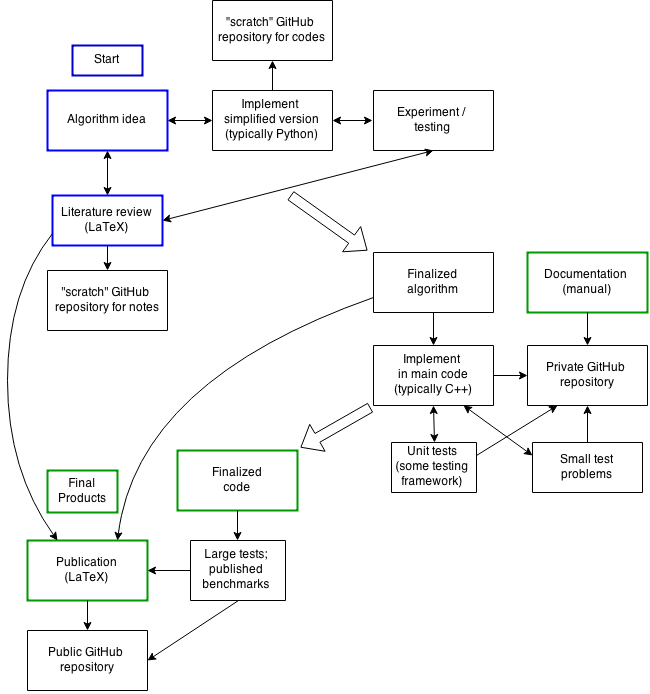

##### Introduction
*Please answer these introductory questions for your case study in a few sentences.*

1) Who are you and what is your research field? Include your name, affiliation, discipline, and the background or context of your overall research that is necessary specifically to introduce your specific case study.

My name is Rachel Slaybaugh, and I am an Assistant Professor in the Nuclear Engineering Department at the University of California, Berkeley.
I study computational methods for neutron transport: numerical methods for solving the Boltzmann equation applied to neutral particle interactions. 
The methods I study are both deterministic (e.g. finite difference, etc.) and stochastic (Monte Carlo).
I develop these algorithms for reactor design and analysis, radiation shielding, and nuclear nonproliferation applications. 
Much of my work has an emphasis on high performance computing. 

2) Define what the term "reproducibility" means to you generally and/or in the particular context of your case study.

The first way I think of reproducibility is that I can reproduce the results in my paper exactly and reproduce the paper itself. 
More broadly I would like for independent researchers to be able to reproduce my results. 
Nuclear engineering codes are often controlled, so depending on the project I am doing the code may not be open source. 
However, such non-open-source codes are typically available at no cost to researchers through a simple licensing process. 

##### Workflow diagram

* specialized tools and where they enter your workflow
* the "state" of the data at each stage
* collaborators
* version control repos
* products produced at various stages (graphics, summaries, etc)
* databases
* whitepapers
* customers

##### Workflow narrative

Referring to your diagram, describe your workflow for this specific project, from soup to nuts. Imagine walking a friend or a colleague through the basic steps, paying particular attention to links between steps. Don't forget to include "messy parts", loops, aborted efforts, and failures.

It may be helpful to consider the following questions, where interesting, applicable, and non-obvious from context. For each part of your workflow:

* **Frequency:** How often does the step happen and how long does it take?
* **Who:** Which members of your team participate (or not)?
* **Manual/Automated:** Is the step automated or does it involve human intervention (if so, is it recorded)?
* **Tools:** Which software or online tools are used in the step? How are they used?

In addition to detailing the steps of the workflow, you may wish to consider the following questions about the workflow as a whole:

* **Data:** Is your raw data online?
   * Is it citeable?
   * Does the license allow external researchers to publish a replication/confirmation of your published work?
* **Software:** Is the software online?
   * Is there documentation?
   * Are there tests?
   * Are there example input files alongside the code?
* **Processing:** Is your data processing workflow online?
   * Are the scripts documented?
   * Would an external researcher know what order to run them in?
   * Would they know what parameters to use?

*(500-800 words)*

##### Pain points
*Describe in detail the steps of a reproducible workflow which you consider to be particularly painful. How do you handle these? How do you avoid them? (200-400 words)*

##### Key benefits
*Discuss one or several sections of your workflow that you feel makes your approach better than the "normal" non-reproducible workflow that others might use in your field. What does your workflow do better than the one used by your lesser-skilled colleagues and students, and why? What would you want them to learn from your example? (200-400 words)*

##### Key tools
*If applicable, provide a detailed description of a particular specialized tool that plays a key role in making your workflow reproducible, if you think that the tool might be of broader interest or relevance to a general audience. (200-400 words)*

##### General questions about reproducibility

*Please provide short answers (a few sentences each) to these general questions about reproducibility and scientific research. Rough ideas are appropriate here, as these will not be published with the case study. Please feel free to answer all or only some of these questions.*

1) Why do you think that reproducibility in your domain is important?

2) How or where did you learn the reproducible practices described in your case study? Mentors, classes, workshops, etc.

3) What do you see as the major pitfalls to doing reproducible research in your domain, and do you have any suggestions for working around these? Examples could include legal, logistical, human, or technical challenges.

4) What do you view as the major incentives for doing reproducible research?

5) Are there any broad reproducibility best practices that you'd recommend for researchers in your field?

6) Would you recommend any specific websites, training courses, or books for learning more about reproducibility?
